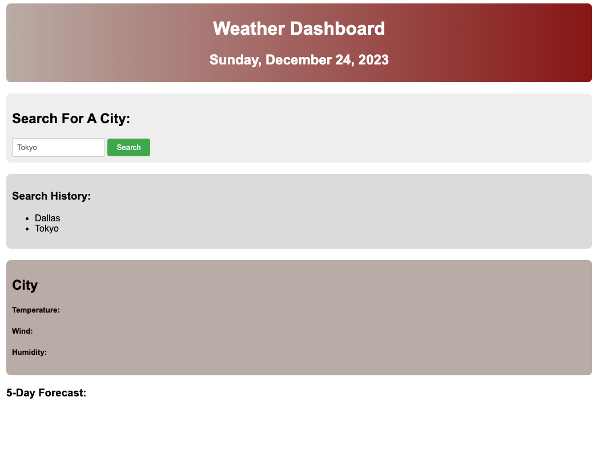
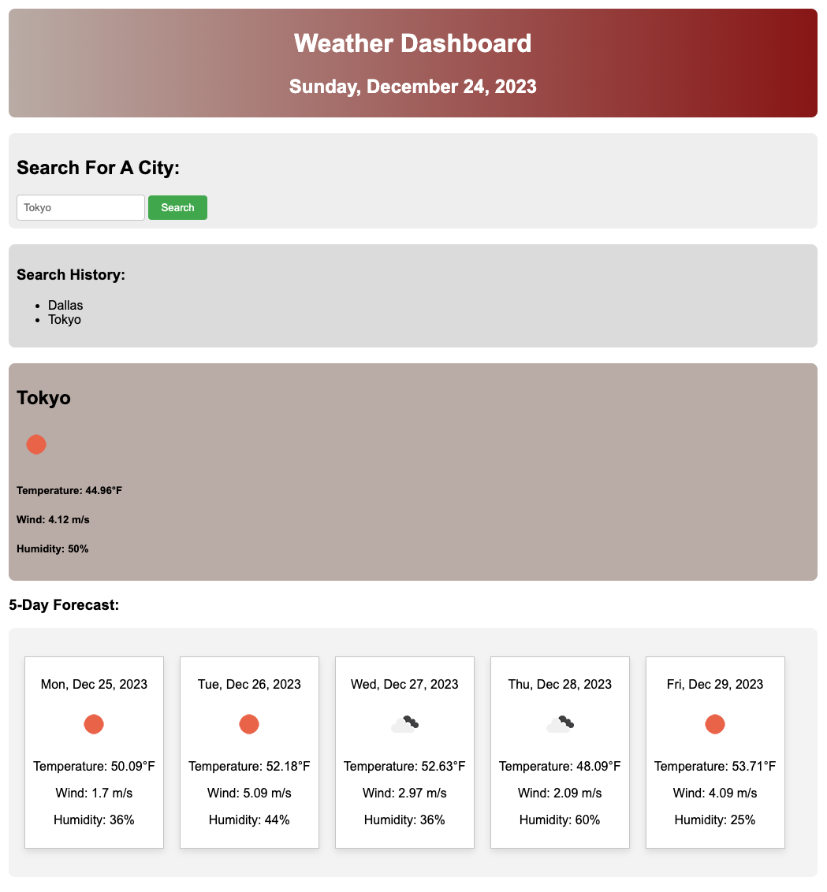

# Weather Dashboard

## The Project

Third-party APIs allow developers to access their data and functionality by making requests with specific parameters to a URL. Developers are often tasked with retrieving data from another application's API and using it in the context of their own. I am building a weather dashboard that will run in the browser and feature dynamically updated HTML and CSS.

I will use the [5 Day Weather Forecast](https://openweathermap.org/forecast5) to retrieve weather data for cities.

I will use `localStorage` to store any persistent data. 

## User Story

```
AS A traveler
I WANT to see the weather outlook for multiple cities
SO THAT I can plan a trip accordingly
```

## Acceptance Criteria

```
GIVEN a weather dashboard with form inputs
WHEN I search for a city
THEN I am presented with current and future conditions for that city and that city is added to the search history
WHEN I view current weather conditions for that city
THEN I am presented with the city name, the date, an icon representation of weather conditions, the temperature, the humidity, and the wind speed
WHEN I view future weather conditions for that city
THEN I am presented with a 5-day forecast that displays the date, an icon representation of weather conditions, the temperature, the wind speed, and the humidity
WHEN I click on a city in the search history
THEN I am again presented with current and future conditions for that city
```

## Installation

N/A

## Usage

The following image shows the web application's appearance and functionality:





## Notes

Few issues to fix: 
1. Need to syle it some more using CSS. 

UPDATE 12/11/23: Embarking on the journey to address code issues, meticulously refactor the existing snippets, and enhance the overall aesthetics of both the codebase and the web application.

## Links

URL to the deployed site: 

[Weather Dashboard](https://gera1313.github.io/weather-dashboard/)

For more information on how to work with the OpenWeather API, refer to the [Full-Stack Blog on how to use API keys](https://coding-boot-camp.github.io/full-stack/apis/how-to-use-api-keys).

## Credits

The following sources helped me in developing this project: 

[How to use API keys](https://coding-boot-camp.github.io/full-stack/apis/how-to-use-api-keys) 

Would like to thank my classmates who have done this challenge already AND my work colleagues who are sofware engineers for the guidance. 

## License

## [](https://opensource.org/licenses/MIT)